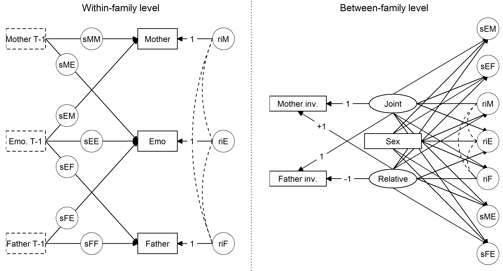

```{r load_packages, include = FALSE}
library("papaja")
library(motley)
source("rfunctions.R")
load("results.RData")
load("table_coefficients.RData")
mask <- FALSE
masked <- function(text){
  ifelse(mask, "[masked]", text)
}
```

```{r analysis_preferences}
# Seed for random number generation
set.seed(42)
```

\setlength{\parskip}{0em}

\vspace{\baselineskip}
Emotional adjustment is defined as the absence of internalizing symptoms and emotional dysregulation [@goodmanPsychometricPropertiesStrengths2001]. It is integral to social competence, academic achievement, and mental health [@grossHandbookEmotionRegulation2013]. Ample research has demonstrated associations between children's emotional adjustment and parenting; both in terms of quantitative involvement (the amount of time parents spend caring for the child), and in terms of qualitative parenting behaviors (how do parents behave towards children). Nevertheless, the existing literature has two major shortcomings. Firstly, in assessing linkages with children’s emotional adjustment, quantitative involvement and qualitative parenting behaviors are rarely jointly investigated. Therefore, we currently do not know how the interplay between quantitative and qualitative involvement relates to emotional development. Children’s emotional adjustment might be differently impacted by parents’  control if that parent is generally highly involved with the day-to-day minutiae of childrearing, than when (s)he is generally absent. Conversely, children’s emotional adjustment might elicit different qualitative parenting behaviors from hands-on parents, who are aware of the reasons for their children’s emotional troubles, than from out-of-touch parents, who might perceive maladjustment as a problem behavior that should be sanctioned. The present study set out to address this question.

Secondly, although fathers have been theorized to play a unique role in emotional adjustment development, empirical work has rarely addressed the joint and relative contributions of fathers' and mothers' involvement. The present study overcomes these limitations by incorporating both quantitative and quantitative measures of mothers' and fathers' involvement. We use sophisticated methods to examine how joint and relative quantitative involvement moderate the longitudinal interplay between mothers' and fathers' qualitative parenting and children's emotional adjustment, from the age of 6 to 12 years. We thus obtain a more comprehensive and nuanced understanding of how fathers' and mothers' involvement relate to children's emotional adjustment development.

## Fatherhood theory

Attachment relationships are grounded in a balance between security and exploration [@grossmannDeveloppementAttachementAdaptation1998]. Fatherhood researchers have posited that warmth and security are more central to mother-child attachment relationships, whereas father-child relationships have been construed as "activation relationships", with greater emphasis on exploration [@paquetteFatherChildActivationRelationship2013]. By encouraging children to venture outside their comfort zone, fathers stimulate a broad spectrum of emotions, thereby expanding children's emotional repertoire, and engaging their developing regulatory abilities  [@flouriFathersBehaviorsChildren2010; @bogelsDoesFatherKnow2011; @parkeFatherInvolvement2000]. Consequently, fathers and mothers are theorized to influence emotional adjustment development in somewhat different ways.

The past decades have seen major strides in the consolidation of theories to guide fatherhood research. Early fatherhood research primarily operationalized involvement in *quantitative* terms: Presence versus absence in divorced families, and the sharing of childcare duties in dual-earner families [@lambBiosocialPerspectivePaternal1987]. Over time, the notion the fathers should share child-rearing responsibilities with mothers, adopting roles historically fulfilled by mothers, gained ground [@pleckFatherhoodIdealsUnited1997]. Consequently, definitions of father involvement evolved to incorporate *qualitative* dimensions, such as warmth and control [@maccobySocializationContextFamily1983; @pleckPaternalInvolvementRevised2004]. 

It is now widely acknowledged that quantitative and qualitative involvement are both relevant to child development [@faganShouldResearchersConceptualize2014; @pleckPaternalInvolvementRevised2004]. Nevertheless, these dimensions are rarely investigated together, let alone in interaction [@craigDoesFatherCare2006; @faganShouldResearchersConceptualize2014]. The present study overcomes this limitation by investigating both qualitative and quantitative involvement, and the interplay between them, in relation to children's emotional adjustment.

## Qualitative parenting and emotional adjustment

Early developmental research focused on parental socialization; the notion that parents shape child development through proximal mechanisms, such as qualitative parenting behaviors [@maccobySocializationContextFamily1983; see also @vanlissaRoleFathersMothers2018a]. Qualitative parenting behaviors have been operationalized in terms of the dimensions underlying parenting styles: Responsiveness and demandingness [@maccobySocializationContextFamily1983]. Substantial evidence indicates that responsiveness, which we operationalized in terms of warm and supportive parenting, is positively associated with children's socio-emotional adjustment [@khalequePerceivedParentalAcceptanceRejection2002; @morrisRoleFamilyContext2007]. 

The literature linking demandingness and emotional adjustment is less conclusive [@morrisRoleFamilyContext2007]. Demandingness encompasses several parenting practices related to setting and enforcing expectations for children's behavior. Some of these might help children meet societal expectations, whereas others are overly restrictive, and interfere with children's autonomy needs [@barberCentralityControlParenting2013]. We examined two aspects of demandingness: Consistency; the extent to which consequences for transgressions are clear and enforced, and inductive reasoning; explaining the reasons for rules and punishments. Consistency has been found to correlate strongly with emotional adjustment [@brandPerceivedParentalInconsistency1990]. There is less empirical evidence for linkages between inductive reasoning and children’s emotional adjustment. Given that inductive inductive reasoning promotes the internalization of parental expectations, including display rules for emotions [@grusecImpactParentalDiscipline1994], we hypothesized that it would be positively related to emotional adjustment.

Negative parenting, which we operationalized as parental anger, is an additional qualitative parenting dimension that is negatively linked with children's emotional adjustment [@changHarshParentingRelation2003; @eisenbergParentalReactionsChildren1999]. 
Parental anger directly undermines children's emotional adjustment [@scaramellaParentingChildrenDistress2008], and models emotional dysregulation [@changHarshParentingRelation2003]. We thus hypothesized that it would be negatively related to emotional adjustment.

Fathers' qualitative involvement is associated with emotional adjustment, even after accounting for mothers' qualitative involvement [@flouriFathersBehaviorsChildren2010]. Although some research suggests that both parents influence children similarly [@lambDevelopmentSignificanceFatherChild2004; @faganShouldResearchersConceptualize2014], there is also evidence for unique contributions of mothers and fathers. For various reasons, mothers and fathers sometimes appear to fulfill somewhat specialized roles [@bogelsDoesFatherKnow2011]. In line with the theoretical notions of "attachment" and "activation" relationships, mothers tend to encourage, and respond more supportively to, emotional expression, whereas fathers structure and sanction emotion expressions to a greater extent [@cassanoInfluenceGenderParental2007; @eisenbergParentalReactionsChildren1999]. Moreover, for adolescents' emotional adjustment, maternal warmth was found to be a more salient socialization mechanism than demandingness, whereas this pattern was reversed for fathers [@vanlissaRoleFathersMothers2018a]. Similar differentiated associations were also found for younger children's psychological adjustment [@mcdowellDifferencesMothersFathers2003]. Finally, there is some evidence that emotional adjustment is more negatively impacted by mothers' negative parenting, compared to fathers [@changHarshParentingRelation2003]; perhaps because negative parenting is incongruous with the notion of the maternal "attachment" relationship. We might therefore expect emotional adjustment to be associated more strongly with maternal warmth and anger, and with paternal demanding behaviors, such as consistency and inductive reasoning.

### Parent or child effects?

A view of the family as a dynamic system, whose members reciprocally influence one another, has become commonplace [@kerrPerceivedParentingStyle2012]. Nevertheless, bi-directional effects are not routinely investigated in the childhood literature [@flouriFathersBehaviorsChildren2010]. The available evidence suggests that maladjustment elicits less parental warmth, more demandingness, and more negative parenting [@gadeyneLongitudinalRelationsParenting2004; @nepplIntergenerationalContinuityParenting2009; @lenguaBidirectionalAssociationsTemperament2005]. 
The adolescent literature provides additional support that emotional maladjustment predicts decreased parental support, and greater demandingness [@otterpohlCrossLaggedRelationsParenting2015; @vandergiessenPerceivedAutonomySupport2014; @wijsbroekDirectionEffectsPerceived2011]. Thus, parents' display punitive responses to maladjustment, including decreased support and increased negative parenting, and corrective responses, such as increased demandingness. We therefore hypothesize that emotional adjustment will positively predict parental warmth, and negatively predict consistency, inductive reasoning, and anger.

### Analyzing the direction of effects

Methods commonly used to examine direction of effects between parents and children have been criticized for yielding biased results if stable between-family differences are not controlled [@hamakerCritiqueCrosslaggedPanel2015]. Innovative methods provide better estimates of dynamic reciprocal processes within families, by controlling for stable differences: The recently developed random-intercept cross-lagged panel model, which is an extension of the standard cross-lagged panel model [@hamakerCritiqueCrosslaggedPanel2015], and dynamic structural equation modeling (DSEM); a multilevel generalization of this model [@asparouhovDynamicStructuralEquation2018]. 

Several studies have re-examined the direction of effects between parents and children using these methods, but mostly in adolescent samples. One such study found that effects of parenting on adjustment that emerged using classical methods, disappeared when stable between-family differences in parenting and adjustment were included in the model [@keijsersParentalMonitoringAdolescent2016]. Another study similarly found that most associations between maternal and paternal qualitative parenting and adolescents' emotional adjustment, were explained by between-family level correlations. The remaining predictive effects consisted primarily of child effects, not parenting effects [@vanlissaRoleFathersMothers2018a]. The authors theorized that this finding was reflective of the relative equality of parent-child relationships in adolescence. If this is correct, we would expect to find more evidence of parenting effects in the present, younger, sample.

<!-- Hier iets over de hypotheses; dat we niet weten wat er within en wat between speelt -->

## Quantitative involvement

### Operationalizing quantitative involvement

Quantitative involvement has been researched extensively in terms of the absolute amount of childcare provided [see @pleckPaternalInvolvementRevised2004]. However, some have argued that the **division** of childcare tasks is more relevant for children's adjustment [@krollEarlyFatherInvolvement2016; @sabattiniRelationMothersFathers2004; @craigHowMothersFathers2011; @feinbergInternalStructureEcological2003]. Indeed, the equity of the childcare distribution is associated with socio-emotional development [@deutschPaternalParticipationChild2001]. Moreover, an unequal distribution often implies that women perform a disproportionate share of the work [@craigDoesFatherCare2006]. This strains the marital relationship [@shockleyItNotWhat2018], and erodes parenting quality, particularly for parents of difficult children [@sheltonInterparentalConflictNegative2008].

There are also methodological advantages to focusing on the distribution of childcare. Operationalizing quantitative involvement in terms of both parents' absolute involvement incurs a potential confound: Effects that appear to be due to fathers' greater involvement might be due to children receiving **more** total care [see @deutschPaternalParticipationChild2001]. This confound can be mitigated by examining the effect of the distribution of childcare, while controlling for total care. Some prior research has attempted to achieve this by assessing the childcare distribution directly, by asking which parent is most responsible for certain tasks [@krollEarlyFatherInvolvement2016; @keizerInfluenceFathersMothers2019]. 

Alternatively, when quantitative involvement has been measured in terms of absolute involvement, one can estimate a latent mean and difference to statistically disentangle joint involvement from relative involvement [@mcardleLatentVariableModeling2009]. Joint involvement reflects the total (average) amount of care provided to children, and relative involvement reflects the extent to which the mother is more involved than the father (i.e., the childcare distribution). 

## Main effects of quantitative involvement

### Effects on qualitative involvement

The amount of time parents spend with children is associated with the quality of parenting behaviors  [@sabattiniRelationMothersFathers2004]. Indeed, more involved parents tend to experience greater parenting self-efficacy, possibly reflecting the effects of experience [@gialloMothersFathersInvolvement2013a]. Furthermore, when both parents are more involved, they monitor each other's parenting behaviors to ensure that children are raised well [@mclanahanConsequencesFatherAbsence2014]. Consequently, we expect greater joint involvement to positively predict both parents' parenting quality.

With regard to differential involvement, we might also expect the more involved parent to display more desirable qualitative parenting behaviors, due to the effects of experience [@sabattiniRelationMothersFathers2004]. However, the benefit of parents monitoring each other's child-rearing should be diminished when parents are not equally involved [@mclanahanConsequencesFatherAbsence2014]. Indeed, retrospective reports indicate that an unequal childcare distribution is associated with suboptimal parenting behaviors: Increased authoritarian parenting in mothers, and increased disengaged parenting in fathers [@sabattiniRelationMothersFathers2004]. Additionally, greater differential involvement might undermine both parents' involvement quality, through its effect on the marital relationship. Childcare responsibilities are a heavy burden [@deutschPaternalParticipationChild2001]. An unfair distribution strains the interparental relationship, interferes with sensitive parenting, and undermines child well-being [@davies2006interparental]. When care is distributed relatively equally, mothers tend to be more satisfied [@pharesFathersMothersInvolvement2009], and the family system more harmonious. Consequently, balanced co-parenting is associated with greater parental warmth [@barnettInterdependenceParentingMothers2008]. We thus expect greater differential involvement to be negatively associated with both parents' parenting quality, and with children's emotional adjustment.

### Effects on emotional adjustment

Bioecological theories of development indicate that children require a certain amount of care, and who provides this care is, to some extent, flexible [see @bronfenbrennerEcologyHumanDevelopment1979]. This implies that joint care should be positively associated with children's emotional adjustment. Relative involvement, on the other hand, might be negatively linked to emotional adjustment, because children feel less supported when they perceive that one of their parents is relatively uninvolved, than when both parents are equally invested in their well-being [@deutschPaternalParticipationChild2001]. 

## Interactions between involvement quality and quantity

Interactions between involvement quality and quantity have largely been overlooked in the parenting literature [@jaffeeLifeFatherBenefits2003]. One notable exception is Feinberg's coparenting model [@feinbergInternalStructureEcological2003]. Coparenting refers to the ways parents relate to each other in the parenting role. Although the coparenting literature is typically invoked to describe child-rearing in divorced families, it also holds insights for intact families. According to Feinberg, the "division of labor" in childcare, analogous to our operationalization of relative involvement, affects qualitative child-rearing behaviors and children's adjustment directly, and moderates the link between these two constructs. 

There is some empirical support for interactions between involvement quality and quantity; for instance, fathers' playful and caring involvement predicted preschoolers' emotional adjustment in school, but only when accompanied by a supportive coparenting relationship [@jiaTransactionalRelationsFather2012]. In adolescence, the quantity of paternal education-related structure, an age-appropriate form of involvement, interacted with paternal warmth to predict both academic achievement and behavioral adjustment [@wangParentalInvolvementAfrican2014]. Applying this insight from the coparenting literature, we might thus expect parents' quantitative involvement to be directly associated with their qualitative parenting behaviors and children's emotional adjustment, and to moderate effects between qualitative parenting behaviors and emotional adjustment. 

## Sex differences

Sex differences are a relevant factor in the interplay between parenting and emotional adjustment. Parents tend to raise boys and girls differently; expressing more demandingness with girls [@pomerantzRoleMaternalControl1998; @vanlissaRoleFathersMothers2018a], and more anger with boys [@strausCorporalPunishmentAmerican1999]. Furthermore, social learning theory posits that the same-sex parent plays a stronger role in socialization; particularly for sex-typed behavior, such as emotion display rules [@busseySocialCognitiveTheory1999]. Finally, mounting evidence suggests that parental warmth is greatest in mother-daughter relationships, and lowest in father-son relationships [see @vanlissaRoleFathersMothers2018a]. We therefore hypothesize that parents will display more warmth, consistency, and inductive reasoning towards girls, and more anger towards boys. Furthermore, we predict stronger associations between qualitative parenting and emotional adjustment between children and their same-sex parent. 

Furthermore, although sex differences in emotional adjustment are sometimes found in older children [@silkAdolescentsEmotionRegulation2003; @vanlissaRoleFathersMothers2018a], a meta-analysis found little evidence for such sex differences in young children [@else-questGenderDifferencesTemperament2006a]. Consequently, we have no hypothesis regarding sex differences in children's average levels of emotional adjustment.

## The present study

The present study aims to make several contributions. First, we include both mothers and fathers, in order to tease apart their common and unique roles in children's emotional adjustment development. Second, we incorporate both qualitative and quantitative measures of involvement, and examine interactions between qualitative and quantitative involvement, which have been largely overlooked in prior work. Third, we disentangle stable between-family differences from dynamic within-family predictive processes, in order to more accurately assess the direction of effects between qualitative involvement and emotional adjustment. Finally, we examined sex as a moderator of between-family differences in all study variables and within-family predictive effects.

# Methods

## Participants

We employed data from the `r masked("K-cohort")` of the `r masked("Longitudinal Study of Australian Children (LSAC)")`, waves `r masked("2-5")`, which were collected by means of biannual home visits, and self-report mail questionnaires, from 2006-2012. Each wave was reviewed and approved by the
`r masked("Australian Institute of Family Studies Ethics Committee")`, which is a Human Research
Ethics Committee registered with the `r masked("National Health and Medical Research Council")`. Documentation of the ethics approval is available online at `r masked("https://growingupinaustralia.gov.au/sites/default/files/certification_of_ethics_approval_for_lsac.pdf")`. `r masked("LSAC")` employed a clustered sampling design to obtain a representative sample of the `r masked("Australian")` population. Complete details regarding the study design, sample, and procedure are available online at `r masked("http://data.growingupinaustralia.gov.au/")`.

Our target sample consisted of 1884 native `r masked("Australian")`, non-minority, intact, biological families. At the first wave, children were approximately 6 years old, $M = 6.28$, $SD = .45$, and 12 at the final wave ($M = 12.42$, $SD = .49$); on agerage, mothers were 34.89 ($SD = 4.71$), and fathers 36.94 ($SD = 5.48$). Most families were dual-earner families, based on income from wages or enterprise ($N = 1067$); the remainder were single-earner families($N = 669$ father-only, $N = 41$ mother-only). Income was recorded in ordered categories. The modal annual income for fathers was between \$26,000-\$51,999 ($N = 663$ fathers reported this value), and for mothers, \$25,999 or less per year ($N = 1152$ reported this value).

## Measures

### Qualitative involvement.

Responsiveness and inductive reasoning were measured using the warmth (e.g., "How often do you express affection by hugging, kissing and holding this child?") and inductive reasoning (e.g., "Talk it over and reason with this child when he/she misbehaved?") subscales of the Child Rearing Questionnaire [CRQ, @patersonAssociationBehaviouralAdjustment2001]. Consistency and negative parenting were measured using the consistency (e.g., "How often is this child able to get out of punishment when he/she really sets his/her mind to it?", reverse coded) and anger (e.g., "How often are you angry when you punish this child?") scales developed by the Canadian National Longitudinal Survey of Children and Youth [NLSCY; @statisticscanadaNationalLongitudinalSurvey2000]. These self-report instruments used five-point scales, ranging from "never or almost never" to "always or almost always".

### Quantitative involvement.

Measures of quantitative involvement varied from wave to wave, due to children's changing care needs [@wangATUSFathersInvolvement2009]. We used the first wave reports as an indicator of between-family differences in quantitative involvement. Both parents rated their involvement in four different child care activities on a five-point scale ranging from "once a day or more" to "not at all" [e.g., "In the past month how often did you help this child brush his/her teeth?"; @baxterFatheringAustraliaCouple2011].

### Emotional adjustment.

Emotional adjustment was measured using the reverse-coded emotional distress subscale of the teacher-reported Strengths and Difficulties Questionnaire, on a three-point scale from "not true" to "certainly true" [e.g., "Often unhappy, downhearted or tearful"; @goodmanPsychometricPropertiesStrengths2001].

## Strategy of analyses

We calculated mean scores for all of the study variables. Scale descriptive statistics, number of items, number of complete cases, and reliability are reported in Supplementary Table 1, and scale correlations are provided in Supplementary Table 2. We deemed it defensible to assume metric measurement invariance (i.e., to assume that the factor loadings of each construct are the same across time points and respondents), as the difference in fit between structurally invariant models, and metrically invariant models, was smaller than .01 on all conventional fit indices: RMSEA, CFI, and TLI (see Supplementary Table 3). 

To address our research questions, we used multilevel, autoregressive structural equation modeling [@asparouhovDynamicStructuralEquation2018]. In this approach, the variance in qualitative parenting behaviors and emotional adjustment is partialized into stable between-individual differences (the mean level for that individual across all measurement occasions), and within-individual fluctuations (deviations from this person-specific mean). This has several advantages: First, controlling for stable between-family differences allows us to estimate the direction of within-family effects more accurately [@hamakerCritiqueCrosslaggedPanel2015]. Any stable factors which might bias cross-lagged effects - such as the influence of SES or neighborhood effects - are accounted for at the between level, and reflected in the correlations between the random intercepts. Secondly, this approach enables us to directly test our hypothesis that between-family differences in quantitative involvement moderate the interplay between qualitative involvement and emotional adjustment: Between-family differences in the interplay between qualitative parenting behaviors and emotional adjustment are estimated as random effects, and we can include between-family level moderators as predictors of these random effects. In this way, we included joint and relative quantitative involvement, and child sex as moderators. Figure \@ref(fig:figure1) shows a graphical representation of the resulting model. We conducted separate analyses for the four qualitative parenting dimensions, because a model including all four variables at once was too complex to estimate. 

```{r figure1, out.width="100%", fig.cap="T-1: previous measurement occasion. ri: random intercept. s: random slope. M: Mother's qualitative involvement. E: Emotional adjustment. F: Father's qualitative involvement. inv: quantitative involvement. Thus, sME represents the random slope of Mothers' qualitative involvement on emotional adjustment."}

```


All analyses were conducted using Mplus 8.0 and the R-package MplusAutomation. This type of multilevel autoregressive model can only be estimated using Bayesian methods. We used two Gibbs-sampler chains of 50000 iterations each. Bayes is a full-information estimator, which means that all available information is used without imputing missing values, and consistent estimation is guaranteed under the assumption that data are missing at random. The missing data handling is likelihood based and guarantees consistent estimation as long as the missing data is missing at random (MAR). We applied mildly informative inverse Wishart priors to the variance/covariance matrices, and normal priors centered on zero for all regression coefficients. We assessed convergence through visual inspections of the chains and posterior distributions. We report the posterior median, and a 95% highest posterior density interval (HPDI). This is the "narrowest" possible interval that contains 95% of samples from the posterior distribution. It represents the most likely population values of the parameter in question. Results are best interpreted by examining the effect size (standardized regression coefficients and correlations), and the width of the HPDI. Significance is not a Bayesian concept, but we use the shorthand "significant" to refer to estimates for which less than 5% of the posterior distribution had the opposite sign from the estimate. All standardized and unstandardized model parameters are reported in Supplementary Table 4.

# Results

## Correlations between qualitative parenting and emotional adjustment

We hypothesized that, at both the within- and between-family levels, warmth, consistency, and inductive reasoning would be positively associated, and anger would be negatively associated, with emotional adjustment. At the between-family level, we examined correlations between the random intercepts of qualitative parenting behaviors and emotional adjustment (see Table \@ref(tab:tabcors)). Random intercepts reflect the average level of each variable across all waves of the study. Counter to our hypotheses, we found no significant correlations between parental warmth and children's emotional adjustment. In support of hypotheses, we found significant positive correlations between maternal and paternal consistency, and emotional adjustment. Contrary to hypotheses, we found that maternal and paternal inductive reasoning were negatively correlated with emotional adjustment. This means that, in families where parents use more inductive reasoning, children displayed poorer emotional adjustment. Finally, as hypothesized, we found significant negative correlations between maternal and paternal anger, and emotional adjustment.

```{r tabcors, results = "asis"}
cor_tables <- lapply(results, corTable)

table_between_cor <- lapply(cor_tables, function(x){x[["Between"]][3:5, 3:5]})
table_between_cor <- order_by_name(table_between_cor)
table_between_cor <- do.call(cbind, table_between_cor)
table_between_cor <- cbind(rename_pars(rownames(table_between_cor)), table_between_cor)
table_between_cor <- as.matrix(table_between_cor)
colnames(table_between_cor) <- c("Parameter", rep(table_between_cor[,1], 4))
rownames(table_between_cor) <- NULL
table_between_cor <- gsub("\\*+", "*", table_between_cor)
table_between_cor <- gsub("^1$", "", table_between_cor)
table_between_cor <- table_between_cor[-3, -seq(2, 11, by = 3)]
table_between_cor <- rbind(c("Between-family level correlations", rep(NA, ncol(table_between_cor)-1)), table_between_cor)

table_within_cor <- lapply(cor_tables, `[[`, "Within.Std.Averaged.Over.Clusters")
table_within_cor <- order_by_name(table_within_cor)
table_within_cor <- do.call(cbind, table_within_cor)
table_within_cor <- cbind(rename_pars(rownames(table_within_cor)), table_within_cor)
table_within_cor <- as.matrix(table_within_cor)
colnames(table_within_cor) <- c("Parameter", rep(table_within_cor[,1], 4))
rownames(table_within_cor) <- NULL
table_within_cor <- gsub("\\*+", "*", table_within_cor)
table_within_cor <- gsub("^1$", "", table_within_cor)
table_within_cor <- table_within_cor[-3, -seq(2, 11, by = 3)]
table_within_cor <- rbind(c("Within-families level correlations", rep(NA, ncol(table_within_cor)-1)), table_within_cor)

table_cors <- rbind(table_between_cor, table_within_cor)
write.csv(table_cors, "table_cors.csv", row.names = FALSE)
#table_cors[is.na(table_cors)] <- ""
rownames(table_cors) <- NULL
#reg_table(table_cors, caption = "Correlations between qualitative parenting and emotional adjustment", note = "Emo.: Emotional adjustment. *: <5% of posterior has opposite sign from estimate.")
reg_table(table_cors, caption = "Correlations between qualitative parenting and emotional adjustment", note = "Emo.: Emotional adjustment. *: <5% of posterior has opposite sign from estimate.")
```

We also examined within-family correlations, which are based on the residuals of the study variables, across all waves and families (Table \@ref(tab:tabcors)). In support of hypotheses, we found significant positive within-family level associations between emotional adjustment and fathers' and mothers' warmth. Notably, these associations were nearly twice as strong for fathers' warmth, as compared to mothers' warmth. In partial support of hypotheses, we found significant positive correlations of emotional adjustment with  mothers', but not fathers', consistency, as well as with fathers', but not mothers', inductive reasoning. Finally, contrary to our expectations, we found no significant within-family associations between children's emotional adjustment and maternal or paternal anger. 

## Within-family predictive effects

At the within-family level, we examined over-time predictive effects between qualitative parenting and emotional adjustment. The intercepts of these random effects reflect the average effect across families. Their variances indicate whether the effect differs in strength (and sign) between families. With regard to within-families parenting effects, none of the intercepts differed significantly from zero, excepting the effect of maternal warmth on children's emotional adjustment (Table \@ref(tab:tabcrosspath)). Thus, on average, mothers' warmth had a positive significant predictive effect on children's emotional adjustment. The variances of all parenting effects were all significant, however, indicating that the effect of qualitative parenting behaviors on children's emotional adjustment varies across families. Moreover, these variances were notably larger for fathers than for mothers, indicating that fathers have a more variable effect on their children through specific parenting behaviors than mothers do.

```{r tabcrosspath, results = "asis"}
tabparenteff <- rbind(tab_std_sections$`Intercepts of parenting effects`, 
                      tab_unst_sections$`Between-family level residual variances`[c(1, 5:6),])

tabparenteff$Parameter <- gsub("^\\(.+on (.+)\\)$", "\\1", tabparenteff$Parameter)
tabparenteff$Parameter[c(1,4)] <- c("Random intercepts of parenting effects of:", "Variance of parenting effects of:")

tabchildeff <- rbind(tab_std_sections$`Intercepts of child effects`,
                      tab_unst_sections$`Between-family level residual variances`[c(1, 7:8),])

tabchildeff$Parameter <- gsub("^\\((.+) on.*$", "\\1", tabchildeff$Parameter)
tabchildeff$Parameter[c(1,4)] <- c("Random intercepts of child effects on:", "Variance of child effects on:")
tab <- rbind(tabparenteff, tabchildeff)
#tab[is.na(tab)] <- ""
rownames(tab) <- NULL

# Add letters for contrast tests

stars <- tab_unst_sections$`Defined parameters`[tab_unst_sections$`Defined parameters`$Parameter %in% c("Mother effect - child effect on mother", "Father effect - child effect on father"), ]
letter <- 1
tabrows <- list(c(2,8),
                c(3, 9))

for(i in 1:length(tabrows)){
  if(any(grepl("\\*", stars[i, ]))){
    for(c in which(grepl("\\*", stars[i, ]))){
      # c = 6
      tab[tabrows[[i]], c] <- paste0(tab[tabrows[[i]], c], letters[letter])
      letter <<- letter + 1
    }
  }
}

tab$Parameter <- gsub("^Variance", "Unstandardized variance", tab$Parameter)
reg_table(tab, caption = "Standardized between-family level intercepts and unstandardized variances of within-family predictive effects", note = "Est.: Estimate. HDPI: Highest posterior density interval. Emo.: Emotional adjustment. *: <5% of posterior has opposite sign from estimate. Matching letters indicate that parameters differed significantly, see Supplementary Table S5.")
```

With regard to child effects, in line with hypotheses, the intercept of the cross-lagged effect of emotional adjustment on maternal warmth was positive and significant (Table \@ref(tab:tabcrosspath)). Thus, when children displayed better emotional adjustment than usual in one year, their mothers displayed more warmth than usual in the next year. Contrary to hypotheses, the intercept of the effect of emotional adjustment on maternal consistency was non-significant. As hypothesized, the intercept for maternal inductive reasoning was positive. Counter to hypotheses, the intercept for maternal anger was positive, not negative. Thus, when children displayed better emotional adjustment than usual in one year, their mothers displayed more anger than usual in the next year. In partial support of hypotheses, the intercept for the child effect of adjustment on paternal warmth was positive and significant. None of the other intercepts for child effects on paternal parenting were significant. The variances of all child effects were all significant but small, indicating that the effect of children's emotional adjustment on their parents' child-rearing behaviors differs somewhat between families.

We established direction of effects by testing the significance of the difference between corresponding parent- and child effects (see Table \@ref(tab:tabcrosspath) and Supplementary Table S5). All effects that were significant in one direction, and non-significant in the opposite direction, had significant difference tests. All effects that were significant (or non-significant) in both directions had non-significant difference tests. 

We examined differences between fathers and mothers the same way. <!-- NOG DOEN -->

## Effects of quantitative involvement on parenting and adjustment

We examined regression coefficients from joint and relative quantitative involvement to the random intercepts of qualitative parenting behaviors and emotional adjustment (Table \@ref(tab:tabinvolvement)). With regard to parenting, we found partial support for our hypotheses: For both parents, joint involvement positively predicted greater warmth, consistency, and inductive reasoning. Notably, the association between joint involvement and warmth was almost double in size for fathers, as compared to mothers. We did not find the hypothesized negative effects of joint involvement on parental anger. Counter to our hypothesis, we found that greater joint involvement was negatively associated with emotional adjustment. Thus, the children in families with highly involved parents generally displayed poorer emotional adjustment. 

With regard to relative involvement, we found partial support for our hypothesis that more skewed relative involvement should predict greater warmth, consistency, and inductive reasoning, and reduced anger, only for the more involved parent. For mothers, the only significant association we found was that, in line with this hypothesis, mothers displayed more warmth when they were relatively more involved than fathers. For fathers, we found that, in line with this hypothesis, fathers displayed less warmth, consistency, and inductive reasoning, when mothers were relatively more involved than fathers. Finally, our hypothesis that children's emotional adjustment would be poorer in families where mothers were relatively more involved than fathers was supported.

```{r tabinvolvement, results = "asis"}
tabinv <- tab_std_sections$`Effects of quantitative involvement on parenting and adjustment`[c(1:4, 1, 5:7),]
tabinv$Parameter[c(1,5)] <- c("Effects of joint quantitative involvement on random intercepts of:",
                              "Effects of relative quantitative involvement on random intercepts of:")
tabinv$Parameter <- gsub("^(.+) on (?!random).*$", "\\1", tabinv$Parameter, perl= TRUE)
#reg_table(tabinv, caption = "Effects of quantitative involvement on parenting and adjustment", note = "Emo.: Emotional adjustment. *: <5% of posterior has opposite sign from estimate.")
tabinvmod <- rbind(
  tab_std_sections$`Moderating effect of quantitative involvement on parenting effects`[c(1:3, 1, 4:5),],
  tab_std_sections$`Moderating effect of quantitative involvement on child effects`[c(1:3, 1, 4:5),])
tabinvmod$Parameter <- gsub("^.+?(Mother|Father).+?$", "\\1", tabinvmod$Parameter)
tabinvmod$Parameter[c(1,4,7,10)] <- c("Moderating effects of joint involvement on parenting effects of:",
                              "Moderating effects of relative involvement on parenting effects of:",
                              "Moderating effects of joint involvement on child effects on:",
                              "Moderating effects of relative involvement on child effects on:")
tab <- rbind(tabinv, tabinvmod)
#tab[is.na(tab)] <- ""
rownames(tab) <- NULL
cat(as.character(reg_table(tab, caption = "Standardized regression coefficients of between-family differences in quantitative involvement on between-family differences in qualitative parenting and emotional adjustment, and on within-family predictive effects", note = "The effects reported in this Table correspond to the 'Between-family level' panel of Figure 1. Est.: Estimate. HDPI: Highest posterior density interval. Emo.: Emotional adjustment. *: <5% of posterior has opposite sign from estimate.")))
```

## Interactions between involvement quality and quantity

To examine interactions between involvement quality and quantity, we tested whether between-family differences in quantitative involvement predicted the within-family cross-lagged effects between qualitative parenting behaviors and emotional adjustment (Table \@ref(tab:tabinvolvement)). With regard to the moderation of parenting effects, the only significant effects we found were for maternal warmth. Specifically, the within-families predictive effect of maternal warmth on emotional adjustment was negatively attenuated when joint involvement was higher, and positively attenuated when mothers were relatively more involved than fathers. We found no moderation for paternal warmth, nor for both parents' consistency, inductive reasoning, and anger.

With regard to the moderation of child effects by quantitative involvement, we found that the effect of adjustment on maternal warmth was negatively attenuated when parents' joint quantitative involvement was higher, and also when mothers' relative involvement was greater compared to fathers. We found no effects for consistency. For inductive reasoning, we found that that the cross-lagged effect of adjustment on maternal inductive reasoning was negatively attenuated when joint involvement was higher. Emotional adjustment was also more negatively predictive of fathers' inductive reasoning when mothers were relatively more involved than fathers. Thus, in families where mothers were more involved than fathers, children's increased emotional adjustment more strongly predicted decreased paternal reasoning - and conversely, decreased emotional adjustment predicted increased paternal reasoning. We found no moderating effects for anger.

## Effects of child sex

We found sex differences in the random intercepts of qualitative parenting behaviors: Fathers displayed less warmth, and both parents displayed more inductive reasoning and anger, towards sons as compared to daughters  (Table \@ref(tab:tabsex)). No significant differences were found for maternal warmth, and for both parents' consistency. We found no sex differences in the random intercept of emotional adjustment. The only cross-lagged effects significantly moderated by child sex were child effects of emotional adjustment on maternal and paternal inductive reasoning. Specifically, emotional adjustment was more negatively predictive of parents' inductive reasoning for boys, as compared to girls. In other words, if children display worse emotional adjustment than usual in one year, parents increase inductive reasoning more strongly for boys than for girls.

```{r tabsex, results = "asis"}
tabsex <- rbind(
  tab_std_sections$`Sex differences in parenting and adjustment`,
  tab_std_sections$`Sex differences in cross-lagged effects`[c(1:3, 1, 4:5),])
tabsex$Parameter <- gsub("^.+?(Mother|Father).+?$", "\\1", tabsex$Parameter)
tabsex$Parameter <- gsub(" on sex$", "", tabsex$Parameter)
tabsex$Parameter[c(1,5,8)] <- c("Sex differences in parenting and adjustment",
                              "Sex differences in parenting effects of:",
                              "Sex differences in parenting effects on:")
#tabsex[is.na(tabsex)] <- ""
rownames(tabsex) <- NULL
reg_table(tabsex, caption = "Standardized regression coefficients of child sex on average levels of qualitative parenting and emotional adjustment, and on within-family predictive effects.", note = "Sex is a binary predictor (-1 = female, 1 = male). The effects reported in this Table correspond to the 'Between-family level' panel of Figure 1. Est.: Estimate. HDPI: Highest posterior density interval. Emo.: Emotional adjustment. *: <5% of posterior has opposite sign from estimate.")
```

# Discussion

## Associations between qualitative parenting and emotional adjustment

In terms of between-family level correlations, we found partial support for our hypotheses. We did not find the hypothesized positive associations between parental warmth and emotional adjustment. The predicted positive associations of parental consistency with emotional adjustment did emerge, indicating that children in families with highly consistent parents tended to be more emotionally well-adjusted. Counter to hypotheses, parents who engaged in more inductive reasoning had children with poorer emotional adjustment. Finally, for anger, we found the predicted negative associations, which means that, in families where mothers or fathers display high anger, children tend to be less emotionally well-adjusted. 

In terms of parenting effects, we found only one effect that was significant on average, i.e., its random intercept was significant and positive: Maternal warmth positively predicted emotional adjustment in most families. However, all within-family predictive effects had significant variance components, which suggests that the fact that the findings discussed here only reflect the average across all families, and that dynamic reciprocal processes vary from one family to the next. Variability was notably greater for fathers, indicating that fathers' influence differs most across families.

Regarding child effects, we found that, on average, well-adjusted children evoked greater warmth from both parents, as hypothesized. Counter to predictions, we did not find average child effects for consistency. In partial support of our hypothesis, we found that children who displayed better emotional adjustment in one year evoked greater inductive reasoning from mothers in the next year. But paradoxically, and counter to oru hypothesis, we also found that children who displayed better emotional adjustment in one year evoked greater maternal anger in the next year.

In sum, we found mixed evidence for our hypotheses that, at both the within- and between-family levels, warmth, consistency, and inductive reasoning would be positively associated, and anger would be negatively associated, with emotional adjustment. 

## Direction of effects

We set out to investigate the direction of effects between parents and children, using innovative methods that control for stable between-family differences, in order to obtain more accurate estimates of within-family effects [@hamakerCritiqueCrosslaggedPanel2015]. We found ample evidence for within-family predictive effects between parental warmth and emotional adjustment, which were bi-directional for mothers. We found no between-family level correlations for warmth. This suggests that warmth has an ongoing positive within-family effect on emotional adjustment. For consistency, however, we found no within-family predictive effects, but only between-family level associations. This suggests that the benefits for emotional adjustment associated with greater consistency might be primarily due to stable between-family differences. 

For inductive reasoning, paradoxically, between-family differences and within-family fluctuations showed opposing patterns of associations with adjustment. This apparently paradoxical finding might be explained by considering that inductive reasoning is a disciplinary behavior - albeit a constructive one [@grusecImpactParentalDiscipline1994]. When parents report engaging in more inductive reasoning, this introduces a confound between *how often* they discipline their children, and *how* they discipline them. The fact that between-family correlations between inductive reasoning and emotional adjustment were negative suggests that between-family differences in inductive reasoning might tap more strongly into how often parents engage in discipline. The within-family fluctuations, by contrast, might reflect changes in how parents discipline their children.

For anger, we found moderately strong between-family level correlations for both parents. Counter to our expectations, however, we found no evidence for within-family correlations or parenting effects. This suggests that the brunt of negative associations between anger and adjustment is explained by between-family differences. One potential explanation for the absence of within-family associations might be a ceiling effect: If the stable level of parental anger in a family is high enough to negatively impact children's emotional adjustment, over-time fluctuations of that anger might no longer make much of a difference. We also found a paradoxical positive predictive effect of emotional adjustment on maternal anger. This means that, if children demonstrated better emotional adjustment than usual in one year, their mothers tended to display more anger than usual in the next year. A possible explanation might be regression to the mean: On average, emotional adjustment showed no-to-negative stability coefficients in all models. That means that better emotional adjustment in one year, was likely to be followed worse adjustment in the next year. The literature on expectation-based loss aversion suggests that mothers might be more angered by a child who unexpectedly displays poor adjustment, than they would be appeased by a child who displays unexpected positive adjustment [@koszegiModelReferenceDependentPreferences].

To recapitulate, we set out to examine the direction of within-family effects by controlling for stable between-family differences. We found only limited evidence for within-family effects, most of which were child effects on parents. Instead, we mostly found evidence for between-family level correlations. We are not the first to find that parent effects are less prevalent once stable between-family differences are accounted for [@keijsersParentalMonitoringAdolescent2016]. In the area of parenting and emotional adjustment development, we are aware of only one prior study that also controlled for stable between-family differences. That study also reported mostly child effects and between-family level corelations in a sample of adolescents [@vanlissaRoleFathersMothers2018a]. The authors explained their findings by proposing that child effects might be more common in adolescence than in childhood, because parent-adolescent relationships are more egalitarian at that age. They argued that the between-family level correlations might reflect the consolidated influence of within-family parent effects that occurred at an earlier age. The fact that the present study similarly found a preponderance of child effects and between-family level correlations in a sample of children from age 6-12 suggests that either parent effects occurred at an even younger age, or that something else is at play.

As similar patterns continue to emerge, it might be worth reflecting on their implications for developmental theory. We should consider the question: To what extent are parents shaping children's development, and to what extent are they adapting to it? Our findings are less congruent with a fully bidirectional conceptualization of reciprocal influence, and more consistent with a model where parents "set the stage" for children's development through their stable differences from other parents, and continue to adjust to children's changing needs over time. Our findings also serve as a reminder that we should be critical of causal interpretations of research that does not control for stable between-family differences, not only in the area of emotional adjustment [e.g., @brandPerceivedParentalInconsistency1990], but in developmental research in general. 

Future research might also devote greater attention to between-family level correlations as an outcome of interest. Between-family level correlations might reflect the consolidated effects of parenting effects that occur at an early age [@vanlissaRoleFathersMothers2018a], or alternatively, they might reflect the influence of third variables that impact both constructs. Economic hardship, for instance, undermines parents' capacity for consistent parenting, as well as children's socio-emotional adjustment [@mcloydImpactEconomicHardship1990]. We should seek to understand why between-family level correlations are so prominent; for example, by comparing their strength in samples with children of different ages, including very young children, or by examining the influence of more sociological factors such as economic hardship and neighborhood effects [@dengFamilyProcessesMediating2006], which are rarely examined in conjunction with sophisticated models of reciprocal influences between parents and children. 

Methodological innovations that examine the role of stable between-family differences can thus inspire more sophisticated theoretical conceptualizations of parental influences in child development. At the same time, we should consider the limitations of these methods. The assumption that within-family fluctuations adequately capture all causal influences that parents exert on their children, for instance, is questionable. Stable factors can also exert changing influences over time. As an illustrative example: The genetic makeup that is passed from parents to children is stable, and yet the expression of some genes emerges over time. It might similarly be possible for stable parental psychosocial characteristics to influence children differently at different time points. Another important limitation is that within-family cross-lagged effects are time scale dependent. If parents shape their children through specific behaviors in dyadic interactions, then annual reflective self-reports might fail to capture parenting effects. Thus, although these methodological innovations are undoubtedly a step forward, they might not be the definitive paradigm for investigating the interplay between parents and children.

## Differences between fathers and mothers

Overall, we found somewhat more evidence for associations of emotional adjustment with mothers' qualitative parenting, than with fathers' parenting, and we found some evidence for differences between mothers' and fathers' roles in emotional adjustment development. These differences all played out at the within-family level, however. Stable between-family differences in either parent's qualitative parenting were all similarly associated with children's adjustment.

At the within-family level we found stronger associations with emotional adjustment for maternal consistency, and for paternal reasoning and warmth. As mentioned before, mothers tend to spend more time with their children than fathers; also in our sample. This might help explain the stronger associations for maternal consistency - a behavior which implies, by definition, consistent repeated interactions with the child. For fathers, associations were stronger for inductive reasoning and warmth - behaviors which can also be expressed in one-off interactions, such as when  disciplining a child (inductive reasoning), or during play time (warmth). The stronger association between inductive reasoning and emotional adjustment for fathers is in line with the classic view of the father as disciplinarian [@flouriFathersBehaviorsChildren2010].

With regard to parenting effects, the only difference between mothers and fathers was for the predictive effect of warmth on emotional adjustment, which was evident only for mothers. This is in line with prior work, indicating that warmth is an important socialization mechanism for mothers [@vanlissaRoleFathersMothers2018a]. With regard to child effects, we found substantial evidence that mothers' parenting was more responsive to children's emotional adjustment than fathers' parenting. Specifically, mothers' anger, inductive reasoning, and warmth were predicted by adjustment, whereas these effects were absent for fathers.

## Quantitative involvement and qualitative parenting behaviors

When both parents were more involved, they displayed greater warmth, consistency, and inductive reasoning. Fathers, in particular, reported substantially greater parental warmth when both parents were more involved. We found that, when mothers performed more care tasks than fathers, mothers displayed more warmth, and fathers displayed less warmth, consistency, and inductive reasoning. This increase in maternal warmth might reflect an attempt to compensate for fathers' absence [@shinnFatherAbsenceChildren1978]. These results are in line with our hypothesis that greater involvement would be associated with more desirable parenting behaviors [@sabattiniRelationMothersFathers2004]. Additionally, they suggest that, when childcare is unequally distributed, fathers engage in less desirable qualitative parenting behaviors [@craigHowMothersFathers2011].

## Quantitative involvement and emotional adjustment

Our operationalization of quantitative involvement, in terms of joint involvement and relative involvement, allowed us to addresses the claim that any effects of father involvement on children's adjustment might in fact be due to children receiving greater total care [@deutschPaternalParticipationChild2001]. However, counter to our hypothesis, joint involvement was *negatively* associated with between-family differences in emotional adjustment. One potential explanation is suggested by self-determination theory: Excessive levels of involvement might undermine children's autonomy needs, thereby leading to increased emotional maladjustment [@vandergiessenPerceivedAutonomySupport2014]. Research on "helicopter parenting" supports this interpretation, as psychological well-being was found to be lower in children of overly involved parents [@schiffrinHelpingHoveringEffects2014]. Another potential explanation is that the amount of quantitative care provided is not only driven by parents' motivation and ability to be involved in their children's lives, but also by children's objective needs. Factors related to children's objective needs - such as developmental delay, or atypical development - might drive an increase in parents' quantitative involvement, and might also be associated with children's emotional maladjustment, resulting in a negative correlation between the two. 

In line with predictions derived from coparenting theory, we found that children's emotional adjustment was lower in families where mothers were more involved than fathers - even after controlling for the total amount of care provided. Although substantial empirical work has indicated that the marital relationship suffers when childcare is unequally distributed [@shockleyItNotWhat2018], our research is one of few to examine the implications for children's adjustment [see also @deutschPaternalParticipationChild2001]. These correlational findings at the between-family level should not be interpreted causally, however. Future research should examine potential pathways, such as whether children's adjustment suffers when they feel like both parents are not equally invested in their well-being, or whether fathers are more likely to withdraw from childcare responsibilities when children display poor emotional adjustment, or whether differential involvement strains the marital relationship, and this strain spills over to children's emotional adjustment.

## Interactions between quantitative and qualitative involvement

We found limited evidence that quantitative involvement moderated within-family parenting effects. One such effect is that the effect of maternal warmth on adjustment was contingent on both joint- and relative quantitative involvement. Mothers' warmth predicted emotional adjustment less strongly when both parents were more involved, and more strongly when mothers were relatively more involved than fathers. These findings suggests a compensatory effect, whereby mothers' warmth can make up for disadvantages incurred by having a relatively uninvolved father [@shinnFatherAbsenceChildren1978].

The evidence that quantitative moderates child effects was somewhat stronger. Firstly, when joint involvement was higher, and when mothers' relative involvement was greater compared to fathers, emotional adjustment became less predictive of maternal warmth. These findings can be interpreted in the context of the sizable average positive effect of adjustment on maternal warmth. In families where mothers' involvement was high - either in terms of joint, or relative involvement - this positive effect was attenuated somewhat. Secondly, joint quantitative involvement positively attenuated the link from emotional adjustment to maternal inductive reasoning. This suggests that mothers have more of a role as disciplinarian in families where both parents are highly involved. When mothers were relatively more involved than fathers, fathers decreased their inductive reasoning more strongly in response to children's positive adjustment, and increased it more strongly in response to maladjustment. Together, these findings suggests that fathers take more of a role as disciplinarian when mothers are relatively more involved in care tasks. 

## Sex differences

In line with prior research, we found that parents raise boys and girls differently. Mothers and fathers both displayed more anger and inductive reasoning with sons than with daughters, and fathers displayed less warmth towards sons. These findings suggest that parents are stricter towards their sons. Parenting effects were not moderated by child sex, suggesting that boys and girls are similarly affected by qualitative parenting behaviors. Child effects were moderated by sex, however: Emotional adjustment was more negatively predictive of both parents' inductive reasoning when children were male. When viewed in the context of the finding that parents were generally stricter with boys, these findings suggest that some of this greater strictness is conditional on sons demonstrating positive adjustment.

## Strengths and Limitations

Several strengths allow us to make unique contributions to the literature. First, mothers and fathers both completed identical parenting measures, which allowed us to disentangle and compare their unique roles in children's emotional adjustment development. Second, we incorporated both quantitative and qualitative involvement. This allowed us to provide a more nuanced overview of the links between parental involvement and emotional adjustment development than prior work, including how the distribution of quantitative childcare relates to parenting quality and emotional adjustment, and moderates links between these two constructs. Although some prior studies have also incorporated both quality and quantity of parenting, this work did not disentangle the total amount of care children received from the relative distribution of care tasks [see @deutschPaternalParticipationChild2001]. We addressed this limitation by estimating the latent mean and difference of absolute maternal and paternal quantitative involvement. This allows us to disentangle the effect of joint involvement, which reflects the total amount of care children receive, from relative involvement, which reflects the childcare distribution. Third, we used innovative methods to examine the extent to which parenting and adjustment are linked at the between- versus within-family level. Compared to methods that do not distinguish between these levels, our approach estimates dynamic reciprocal processes within the family more accurately. Our findings contribute to a growing literature suggesting that stable between-family differences might play a larger role than was previously thought, even in early childhood. Confidence in the results is bolstered by the fact that we used multi-informant reports: Each parent reported on their own parenting, and teachers reported on children's emotional adjustment. This avoids common method bias and single reporter bias. As teachers are likely to be "blind" to parents' child-rearing behavior, and have no stake in the parent-child relationship, their reports might be less biased in general.

A potential limitation of the present study is that teachers' reports of emotional adjustment might be more noisy than self- or parent-reports. A teacher is responsible for many pupils, and might not be aware of each pupil's emotional adjustment. Moreover, although the instrument we used assessed *overt* symptoms of emotional maladjustment, people are generally poor judges of others' emotional states [@ickesEmpathicAccuracy1997]. Consequently, our effect sizes might be attenuated by noisy measures of emotional adjustment. Teachers' reports do have clear benefits as well: Young children might lack the ability to report accurately on their own emotional adjustment, and using clinical assessments might be unfeasible for large-scale panel studies. Another limitation to consider is the fact that we operationalized qualitative parenting in terms of specific parenting behaviors, whereas others have focused on parenting *styles* composed of specific combinations of these behaviors [@maccobySocializationContextFamily1983]. We focused on specific parenting behaviors for two reasons. First, although aggregating specific parenting behaviors into parenting styles is theoretically defensible, it also amounts to data reduction. This would prevent a fine-grained investigation of differences between mothers' and fathers' unique roles in child-rearing. Moreover, the longitudinal models we used are not suitable for categorical variables, such as parenting style. Still, we have to acknowledge the possibility that the constellation of parenting behaviors is more important than each dimension in isolation. Finally, one potential limitation is that we only included quantitative involvement in the first year of the study. This was done for pragmatic reasons: Children's developmental needs change rapidly, especially in the first years of life. It would be impossible to establish measurement invariance for quantitative involvement from age 6 to 12. Our approach assumes that a "snapshot" of quantitative involvement at age 6 taps into parents' general level of involvement. Consequently, we are unable to assess whether within-person fluctuations in qualitative and quantitative involvement interact. Future research intending to examine such interactions at the within-family level might instead choose to focus on a more restricted age range. A final potential limitation pertains to the generalizability of the findings. Our target sample consisted of native `r masked("Australian")`, non-minority, intact, biological families. It is possible, but beyond the scope of this study, that the findings might have limited generalizability for Australian minorities, or for families in other industrialized nations.

## Conclusions

Our findings suggest that, in families where mothers were more involved than fathers, there was greater differentiation between the roles mothers' versus fathers' qualitative parenting played in children's emotional adjustment development. In such families, maternal warmth was more strongly predictive of, and less dependent on, children's emotional adjustment, and fathers' inductive reasoning - a disciplinary strategy - was more contingent on children's emotional adjustment. This suggests that, when differential involvement was higher, parents adopted more differentiated roles: Mothers' role more strongly resembled that of the classic warm "attachment figure", and fathers that of an authority figure. When both parents were more involved, mothers' warmth was less strong of a predictor for emotional adjustment, and mothers' inductive reasoning also became more contingent on adjustment, suggesting that mothers in such families played more similar roles to fathers.

We found substantial evidence that both parents reported engaging more in behaviors that are positively associated with children's adjustment when joint involvement was higher. Conversely, when mothers were more involved than fathers, mothers' expressed more warmth, but fathers displayed less desirable parenting behaviors (less consistency, inductive reasoning, and warmth). Children's emotional adjustment, too, was lower when mothers were more involved than fathers. These findings highlight the important of considering interactions between quantitative and qualitative involvement, and suggest that all family members might benefit from a more equal distribution of childcare tasks.

With regard to mothers' versus fathers' unique roles in children's emotional development, we found that, in line with the notion of the mother as a warm, supportive attachment figure, maternal warmth and consistency were associated with children's emotional adjustment. Evidence for fathers' unique role was relatively limited; significant within-family correlations between paternal inductive reasoning and emotional adjustment suggest that fathers might play a role in the capacity of disciplinarian. The aforementioned interaction effects between qualitative and quantitative involvement, however, seem to suggest that - above all - the role of fathers is more context dependent than that of mothers.

\newpage

# References
```{r create_r-references}
#r_refs(file = "r-references.bib")
```

\begingroup
\setlength{\parindent}{-0.5in}
\setlength{\leftskip}{0.5in}
\setlength{\parskip}{0em}

<div id = "refs"></div>
\endgroup
